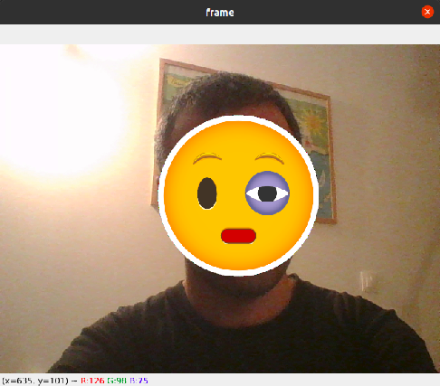
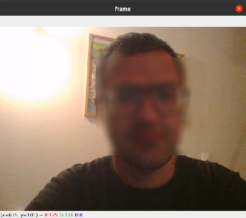
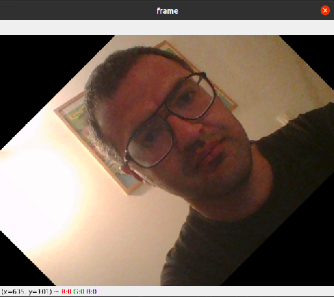

# image_processing_Assignment_23
## Face detection

- Real-time camera that can place stickers on face.
- features:

  - Place a non-square sticker on the face
  - Place the sticker on the eyes and lips
  - Place a blur on the face
  - edge detection on the face
  - rotate video by 45 degrees

- [x] **Emoji on Face**                

 

- [x] **Emoji on Eyes and Lips**       

 

- [x] **Blur Face using Gaussian Blur**          

 

- [x] **Edge detection using Canny function**     

 

- [x] **Rotate face by 45 degrees around the center of the image**       

